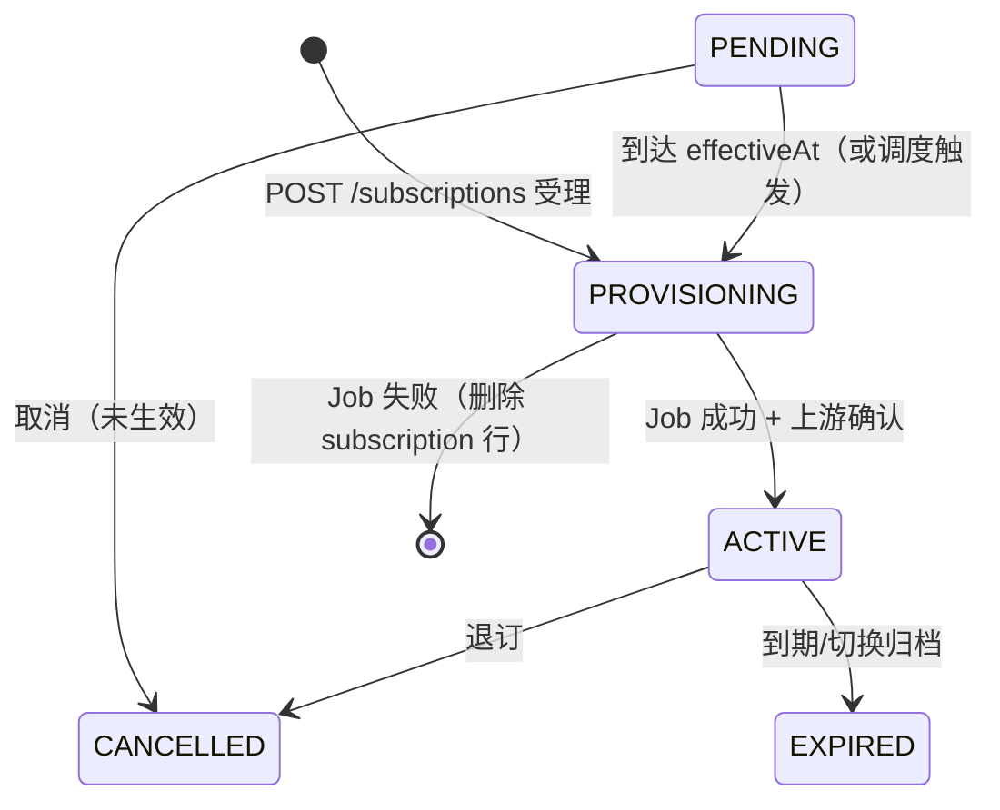

# 订阅开通、上游产品映射与 Package 发布

**Feature**: `iot-cmp-reseller` | **Status**: 规范真源（2026-05-19）

## 背景

每个 **Package** 通过 **Carrier Service** 锚定在 **单一 `supplier_id` + `operator_id`** 网络上下文（见 [spec.md](../spec.md) User Story 3）。**MUST NOT** 将同一 `packageId` 用于多个上游供应商/运营商 SIM 的通用产品定义。

下游客户对 ICCID 订阅本系统 Package 时，**MUST** 同步在上游供应商侧开通对应产品；否则运营商网络侧无正确产品包，业务不可用。

本文档约定：**Package 发布时建立上游映射**、**订阅创建时异步 Job 开通**、**订阅状态机扩展**、**上游失败时删除本地订阅并通知下游客户**。

---

## 1. Package 模块接口边界

| 范围 | 约定 |
|------|------|
| **不变** | `POST/PUT/GET` Package、`GET` 列表/反查等 **创建与编辑** 流程；四模块绑定语义不变 |
| **扩展** | **仅** `POST /v1/packages/{packageId}:publish` 增加请求体（见 §2） |
| **不变** | Carrier Service / Price Plan / APN / Roaming 等模块 HTTP **不**因映射而改动 |

---

## 2. Package 发布与上游产品映射

### 2.1 发布接口

```
POST /v1/packages/{packageId}:publish
```

**Request Body**（**新增**）:

```json
{
  "externalProductId": "string (required)",
  "provisioningParameters": "object (optional)"
}
```

| 字段 | 说明 |
|------|------|
| `externalProductId` | 上游供应商系统中的产品包 ID（运营商侧产品码） |
| `provisioningParameters` | 可选；适配器/上游所需的附加参数（JSON），持久化于映射表 |

**服务端推导（MUST NOT 由客户端传入）**:

| 字段 | 来源 |
|------|------|
| `package_id` | 路径参数 |
| `supplier_id` | Package → `carrier_service_modules.supplier_id` |
| `operator_id` | Package → `carrier_service_modules.operator_id`（校验与审计用；映射表可不冗余存储） |

### 2.2 映射表 `vendor_product_mappings`

**语义（收紧）**:

- **1 个已发布 Package ⇔ 至多 1 条映射**（`UNIQUE(package_id)`）
- `supplier_id` **MUST** 与 Package 所引 Carrier Service 的 `supplier_id` **一致**；发布写入时由服务端填充，**禁止**客户端指定其它 supplier
- `external_product_id` = 请求体 `externalProductId`

**不变量**:

- **`packages.status = PUBLISHED` ⇒ MUST 存在且仅存在一条 `vendor_product_mappings` 行**
- 发布与插入映射 **MUST** 同一事务（或等价原子语义）；映射写入失败则 Package **不得** 变为 `PUBLISHED`

**独立 CRUD**（`POST /v1/vendor-product-mappings` 等）:

- 保留供平台运维 **补录/修正** `externalProductId`；**MUST** 遵守同一 `supplier_id` 推导规则
- **新 Package 的标准路径** 为 `:publish` 一次性完成发布 + 映射

### 2.3 发布前校验（在既有四模块 `PUBLISHED` 校验之上）

- Carrier Service 行 **MUST** 含非空 `supplier_id`、`operator_id`
- `externalProductId` **MUST** 非空

### 2.4 错误码（发布）

| HTTP | code | 说明 |
|------|------|------|
| 400 | BAD_REQUEST | `externalProductId` 缺失或非法 |
| 409 | INVALID_STATUS | 非 `DRAFT` |
| 409 | MAPPING_ALREADY_EXISTS | 该 `packageId` 已有映射（重复发布） |

---

## 3. 订阅状态机（扩展）

### 3.1 `subscription_state` ENUM

在原有 `PENDING | ACTIVE | CANCELLED | EXPIRED` 基础上 **新增**:

| 状态 | 含义 |
|------|------|
| **PROVISIONING** | 订阅请求已受理，**上游开通 Job 已创建或执行中**；本地记录存在，**尚未** 获得上游确认，**不得** 按 `ACTIVE` 计费或对外宣称已开通 |
| **PENDING** | **仅** 表示 **`effectiveAt` 尚未到达** 的预约订阅；到达生效窗口前 **可** 不调用上游（或按能力协商提前 SCHEDULED_ON_SUPPLIER） |
| **ACTIVE** | 上游开通 **已成功**，且已满足生效时间条件 |
| **CANCELLED** | 已撤销 |
| **EXPIRED** | 到期或被替换后归档 |

**说明**: **不** 引入持久化 `PROVISIONING_FAILED` 订阅行；上游终态失败见 §5（删除本地行）。

### 3.2 状态迁移（创建订阅 · 立即生效）



### 3.3 与 `effectiveAt` 的组合

| 场景 | 初始 `state` | 上游调用时机 |
|------|--------------|--------------|
| **立即**（`effectiveAt <= now`） | `PROVISIONING` | 创建 Job **立即** 执行 |
| **预约**（`effectiveAt > now`） | `PENDING` | 到 `effectiveAt`（或 Job `scheduled_at`）再入队/执行；进入执行后 → `PROVISIONING` |

---

## 4. 创建订阅（`POST /v1/subscriptions`）流程

与 [SIM 生命周期 Job](./jobs-sim-status-change.md) 对齐：**同步受理 + 异步 Worker + 事件/Webhook 通知**。

### 4.1 同步校验（API 层）

1. SIM 存在、租户归属、企业 `ACTIVE`
2. SIM **非** `RETIRED`
3. Package **`PUBLISHED`**
4. **`vendor_product_mappings`** 存在且 `package_id` 匹配；`supplier_id` 与 Package Carrier Service **一致**（由映射行 + CS 双重保证）
5. **`sim.supplier_id` MUST 等于** Package → Carrier Service 的 `supplier_id`
6. **`sim.operator_id` MUST 等于** Package → Carrier Service 的 `operator_id`（比较口径与 OpenAPI `operatorId` / **`operators.business_operator_id` 解析**一致，见 [operator-identity-model.md](./operator-identity-model.md)）
7. MAIN 互斥、ADD_ON 规则（既有）
8. SIM 已分配 `supplier_id`（缺失 → `409 MISSING_SUPPLIER`）

### 4.2 同步写入

1. `INSERT subscriptions`（`state` = `PROVISIONING` 或 `PENDING`，见 §3.3）
2. `INSERT jobs`（`job_type` = **`SUBSCRIPTION_PROVISION`** 或项目约定等价类型；`QUEUED`）
3. 写 `audit_logs`（`SUBSCRIPTION_CREATED`）

### 4.3 同步响应

- HTTP **202 Accepted**（推荐）或 **201** + 明确 `jobId`
- Body **MUST** 含：`subscriptionId`、`jobId`、`state`、`packageId`、`iccid`、`effectiveAt`
- **MUST NOT** 在同步响应中宣称 `ACTIVE`（除非未来显式定义「无上游适配器的本地-only 模式」，当前 **不在** 范围）

### 4.4 Worker

1. 读取 Job + subscription + SIM + mapping
2. 解析 `external_product_id`；调用供应商 SPI **`changePlan`**（或等价「订阅/换包」操作）
3. **成功**: 更新 `subscriptions.state` → `ACTIVE`（若仍为 `PENDING` 且未到生效时间，则保持 `PENDING` 直至生效 — 以实现与能力协商为准）；`job.status` → `SUCCEEDED`
4. **失败**: 见 §5

### 4.5 批量创建

`POST /v1/subscriptions:batch-create` **MUST** 与单笔 **逐 ICCID** 遵循相同校验、Job 与通知语义（允许部分成功）。

---

## 5. 上游失败：删除本地订阅 + 通知下游客户

当 **`SUBSCRIPTION_PROVISION` Job 终态失败**（上游拒绝、超时、适配器不可用等）:

1. **`DELETE`（或等价硬删除）** 该 `subscription_id` 对应 **`subscriptions` 行**
2. **`job.status` = `FAILED`**，`error_summary` 记录上游原因
3. **MUST NOT** 保留 `PROVISIONING` / 失败态订阅行供计费或列表展示
4. **审计**: `audit_logs` 保留 `SUBSCRIPTION_PROVISION_FAILED`（或等价 action），`after_data` 含 `iccid`、`packageId`、错误摘要
5. **事件**:
   - **`JOB_FINISHED`**（`jobStatus=FAILED`）
   - **`SUBSCRIPTION_PROVISION_FAILED`**（或扩展 **`SUBSCRIPTION_CHANGED`** payload 含 `outcome=FAILED`；OpenAPI 以实现选定事件名为准，**MUST** 在 integration-api 中栏注）
6. **Webhook**: 按 [webhook-delivery.md](./webhook-delivery.md) 向 **下游客户系统**（企业/代理商已配置的 `webhook_subscriptions`）投递上述事件

**下游客户系统** 应通过 `jobId` + 事件 payload（`iccid`、`packageId`、`errorCode`/`message`）感知失败；**不得** 再 `GET /subscriptions/{id}` 期望该失败订阅存在。

---

## 6. 上游成功：通知下游客户

Job **`SUCCEEDED`** 且订阅进入 **`ACTIVE`**（或预约场景下进入约定状态）时:

1. **`SUBSCRIPTION_CHANGED`**（`afterState=ACTIVE` 等）
2. **`JOB_FINISHED`**（`jobStatus=SUCCEEDED`）
3. Webhook 投递（同上）

---

## 7. 与 US8 / Reconciliation 的关系

- **Reconciliation** 仍以上游为准做 **SIM 状态/清单** 对账；本文档聚焦 **订阅开通** 路径
- **`provisioning_orders`** 表（若落地）可作为 Job 的补充审计；**真源** 以 `jobs` + `subscriptions` + `vendor_product_mappings` 为准，见 [data-model.md](../data-model.md)

---

## 8. 验收场景

1. **Given** `DRAFT` Package 且四模块均已 `PUBLISHED`, **When** `POST :publish` 带 `externalProductId`, **Then** Package 为 `PUBLISHED` 且存在一条 `vendor_product_mappings`，`supplier_id` 等于 Carrier Service 的 supplier
2. **Given** 无 `externalProductId`, **When** `POST :publish`, **Then** `400 BAD_REQUEST`，Package 仍为 `DRAFT`
3. **Given** `PUBLISHED` Package + 映射 + SIM 的 supplier/operator 与 Package CS 一致, **When** `POST /subscriptions`, **Then** HTTP 202、`jobId` 非空、`state=PROVISIONING`（立即生效）或 `PENDING`（预约）
4. **Given** SIM supplier 与 Package CS supplier 不一致, **When** `POST /subscriptions`, **Then** `409 PACKAGE_SUPPLIER_MISMATCH`（或等价码）
5. **Given** Job 执行且上游成功, **When** Worker 完成, **Then** `subscription.state=ACTIVE`、`job.status=SUCCEEDED`，投递 `SUBSCRIPTION_CHANGED` + `JOB_FINISHED`
6. **Given** Job 执行且上游失败, **When** Worker 完成, **Then** **无** 该 `subscriptionId` 行、`job.status=FAILED`，投递 `JOB_FINISHED` + 失败类订阅事件，Webhook 送达下游客户

---

## 相关文档

- [spec.md — US3 Package / US4 订阅 / US8 映射](../spec.md)
- [pricing-api.md §6.2 / §7.1](../contracts/pricing-api.md)
- [data-model.md — `subscription_state`、`vendor_product_mappings`](../data-model.md)
- [jobs-sim-status-change.md](./jobs-sim-status-change.md)
- [webhook-delivery.md](./webhook-delivery.md)
