> Generated by [**TTADK**](https://bytedance.larkoffice.com/wiki/Gw0ewxEbHi1K0NkVd2YcNwvVnTg) (TikTok Agent Development Kit)


## 1. 业务背景

**目标**: 在现有 IoT CMP 平台（64 端点、30+ 表）基础上，构建完整的代理商转售体系，实现"供应商 → 代理商 → 企业"三级多租户连接管理与计费能力。

**量化目标**:
- 首期支撑 10 万张 SIM 卡管理，核心接口 P95 延迟 < 300ms
- 计费引擎通过全部 20 项 Golden Test Cases（U-01~U-09, M-01~M-04, C-01~C-03, A-01~A-02, O-01~O-02）
- 多租户数据隔离 100% 有效，Reconciliation 差异率 < 0.1%
- 系统可用性 99.9%，8 周内交付 MVP 最小闭环

---

## 2. 需求分析

### 2.1 现状

当前系统为 Fastify + TypeScript 单体应用，已具备 64 个 API 端点、18 个已有数据库迁移（+ 17 个新增计划）、30+ 表、21 个 ENUM、1 个供应商适配器（微众耕）、基础计费引擎（254 行）和异步任务处理器（258 行）。

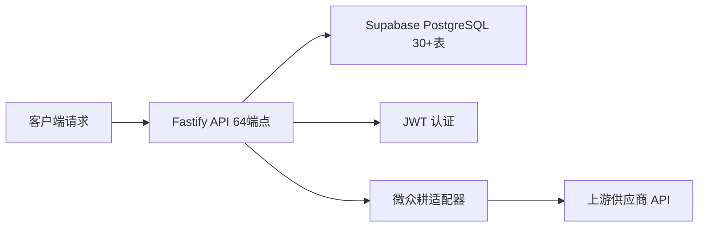

### 2.2 业务目标

1. **多租户转售体系**: 构建供应商→代理商→企业→部门四级组织层级，RBAC 权限隔离，白标能力
2. **SIM 全生命周期**: 5 状态机管理（INVENTORY→TEST_READY→ACTIVATED→DEACTIVATED→RETIRED），批量导入、上游同步
3. **产品包与资费**: 产品包四模块（Price Plan / Carrier Service / Commercial Terms / Control Policy），其中 Price Plan 支持 4 种类型（One-time/SIM Dependent Bundle/Fixed Bundle/Tiered Volume）
4. **计费闭环**: 高水位月租费、Waterfall 用量匹配、分段累进、三级账单、自动出账、调账
5. **信控催收**: Dunning 时间轴（逾期→宽限→暂停→阻断），不自动变更企业状态，复机为手工操作
6. **集成可观测**: 多供应商虚拟化层（SPI）、上游对账、告警去重、Webhook（HMAC-SHA256）、统一事件架构

### 2.3 功能模块划分

| 功能模块 | 功能点 | 变更类型 | 依赖 |
|:---------|:-------|:---------|:-----|
| 多租户与权限（US1） | RBAC 细粒度鉴权中间件 | 增强 | users, roles, role_permissions, permissions |
| | 白标品牌配置 | 新增 | resellers.branding_config |
| | 企业状态变更+事件触发 | 增强 | customers, events |
| | 部门管理 | 增强 | departments（归属 customers） |
| SIM 生命周期（US2） | SIM 清单字段扩展（Multi-IMSI/eSIM/IMEI Lock） | 增强 | sim_cards 表（四方归属链） |
| | SIM 批量导入（10万条/幂等） | 增强 | jobs 表 ALTER |
| | SIM 状态机约束强化 | 增强 | app.ts 端点逻辑 |
| | SIM 上游同步双向对齐 | 增强 | vendor adapter |
| 产品包与资费（US3） | 资费计划 CRUD + 版本化 | 新增 | price_plans, price_plan_versions |
| | 产品包 CRUD + 发布流程 | 新增 | packages, package_versions |
| | 产品包四模块编排（资费/运营商业务/商业条款/控制策略） | 新增 | package_versions, profile_versions |
| | PAYG 冲突校验 | 新增 | 发布阶段校验逻辑 |
| 订阅管理（US4） | 订阅创建/切换/退订 | 新增 | subscriptions |
| | 主套餐互斥校验 | 新增 | 业务规则层 |
| 计费引擎（US5） | 高水位月租费 | 增强 | billing.ts, sim_state_history |
| | Waterfall 用量匹配 | 增强 | billing.ts |
| | SIM Dependent Bundle 动态池 | 增强 | billing.ts |
| | 分段累进阶梯计费 | 增强 | billing.ts |
| 账单与出账（US6） | 三级账单结构（L1/L2/L3） | 增强 | bills, bill_line_items ALTER |
| | 自动出账（T+N） | 新增 | queues/handlers.ts / Vercel Cron |
| | PDF/CSV 导出 | 新增 | 文件生成逻辑 |
| | 人工核销 + 调账审批 | 增强 | bills, adjustment_notes |
| 信控催收（US7） | Dunning 时间轴 | 新增 | dunning_records, dunning_actions 表 |
| | 批量停机建议（人工触发） | 新增 | sim_cards:batch-deactivate |
| | 复机恢复（人工） | 新增 | dunning:resolve 端点 |
| 上游对账（US8） | Reconciliation 任务 | 新增 | reconciliation_runs 表 |
| | 供应商产品映射 | 新增 | vendor_product_mappings 表 |
| | 开通同步订单 | 新增 | provisioning_orders 表 |
| 监控告警（US9） | 告警去重与抑制 | 新增 | alerts 表 |
| | 连接诊断代理 | 增强 | vendor adapter |
| 虚拟化层（US10） | SPI 接口定义 | 新增 | ProvisioningSPI/UsageSPI/CatalogSPI |
| | 能力协商 | 新增 | SupplierCapabilities |
| 事件架构（US11） | Webhook 订阅与投递 | 新增 | webhook_subscriptions, webhook_deliveries 表 |
| | 统一事件目录（6 类型） | 增强 | events 表 |

### 2.4 用例图

**角色**:
- **系统管理员**: 租户初始化、全局配置、出账触发、对账
- **代理商管理员**: 企业管理、SIM 导入/生命周期、产品包配置、计费管理、信控操作
- **代理商销售**: SIM 分配、订阅创建/切换
- **代理商财务**: 账单查看、核销
- **企业管理员**: 企业内 SIM 查看、部门管理、账单查看
- **企业运维**: 所属部门 SIM 查看/诊断

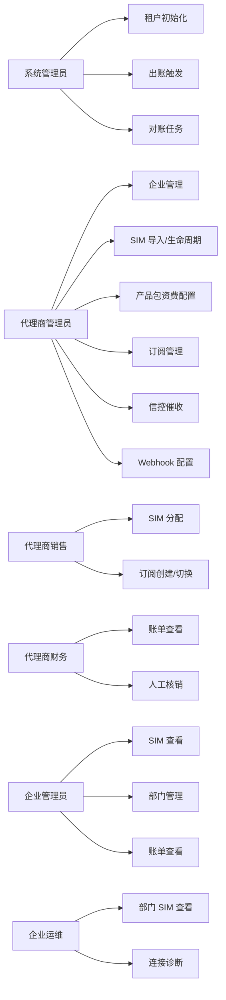

---

## 3. 系统设计

### 3.1 网络拓扑

```
客户端（Web/API）
    │ HTTPS + JWT / API Key
    ▼
Vercel Edge Network（全球 CDN + Serverless Functions）
    │
    ├──── Fastify API（app.ts，64+新增端点）
    │         │
    │         ├── Supabase REST Client（重试+熔断器）
    │         │         │
    │         │         ▼
    │         │    Supabase PostgreSQL 15+（RLS 行级安全）
    │         │
    │         ├── Queue Handlers（异步任务处理器）
    │         │         │
    │         │         ├── 计费引擎（billing.ts）
    │         │         ├── Webhook 投递
    │         │         └── 批量操作
    │         │
    │         └── Vendor Adapter Layer（SPI）
    │                   │
    │                   ├── wxzhonggeng 适配器
    │                   └── (未来更多供应商)
    │
    ▼
上游供应商 CMP API（HTTPS）
```

### 3.2 整体架构图

> 红色标记为本次需变更的模块

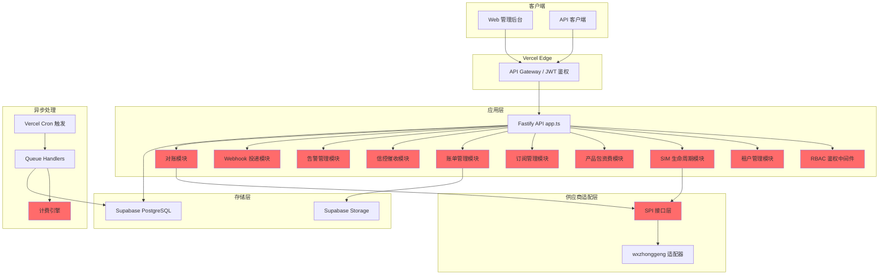

### 3.3 RBAC 权限配置（当前实现）

权限按 `roleScope`（platform/reseller/customer/department）分配，定义于 `defaultPermissionsByRoleScope`（`src/app.js`、`src/middleware/rbac.ts`）。请求路径由 `resolvePermissionForRequest` 映射为权限码，`permissionGuard` 校验用户是否具备该权限。

| 权限码 | 说明 | 典型路径 |
|:-------|:-----|:---------|
| bills.list | 账单列表 | GET /v1/bills |
| bills.read | 账单详情 | GET /v1/bills/{id} |
| bills.export | 账单导出 | GET /v1/bills:csv |
| bills.mark_paid | 标记已付 | POST /v1/bills/{id}:mark-paid |
| bills.adjust | 调账 | POST /v1/bills/{id}:adjust |

**禁止 enterprise 用户访问 bills 模块**：从 `customer` 和 `department` 的 `defaultPermissionsByRoleScope` 中移除 `bills.list`、`bills.read`、`bills.export`、`bills.mark_paid`、`bills.adjust` 即可。platform_admin 与 platform scope 拥有全量权限，不受此配置限制。

**V1.1 规划**：Phase 23 将实现 RBAC 数据库驱动配置（roles/permissions/role_permissions 三表），支持 reseller_admin、reseller_sales_director、reseller_sales、reseller_finance、customer_admin、customer_ops 六种角色的权限按表动态配置。

### 3.4 数据同步

| 源 | 目标 | 同步方式 | 频率 |
|:---|:-----|:---------|:-----|
| 上游供应商 CDR | usage_daily_summary | SFTP 批量 + API | 每日批量 + 准实时 |
| 上游供应商 SIM 状态 | sim_cards.upstream_status | Webhook 回调 / 轮询 | 准实时 |
| 计费引擎 rating_results | bills + bill_line_items | 内部批处理 | T+N 出账时 |
| events 表 | webhook_deliveries | Worker 投递 | 事件驱动 |
| sim_cards 状态变更 | sim_state_history | 触发器/应用层 | 实时 |
| Dunning 检测 | dunning_records + dunning_actions | Cron 轮询 | 每日 |

### 3.5 领域模型 / ER 图

> 包含所有核心实体及其关系，新增表以 NEW 标注

```mermaid
erDiagram
    suppliers ||--o{ upstream_integrations : "关联"
    operators ||--o{ upstream_integrations : "关联"
    suppliers ||--o{ sim_cards : "提供"
    operators ||--o{ sim_cards : "归属"

    resellers ||--o{ customers : "管辖"
    resellers ||--o{ users : "拥有"
    customers ||--o{ users : "拥有"
    users ||--o{ roles : "角色(通过 user.role_id)"
    roles ||--o{ role_permissions : "权限绑定"
    permissions ||--o{ role_permissions : "被绑定"

    resellers ||--o{ sim_cards : "代理商归属"
    customers ||--o{ sim_cards : "企业归属"
    customers ||--o{ price_plans : "企业资费"
    customers ||--o{ packages : "企业产品包"
    customers ||--o{ subscriptions : "企业订阅"
    customers ||--o{ bills : "企业账单"
    customers ||--o{ dunning_records : "信控 NEW"
    customers ||--o{ webhook_subscriptions : "Webhook NEW"

    sim_cards ||--o{ sim_state_history : "状态历史"
    sim_cards ||--o{ subscriptions : "订阅"
    sim_cards ||--o{ usage_daily_summary : "用量"
    sim_cards ||--o{ alerts : "告警 NEW"

    price_plans ||--o{ price_plan_versions : "版本"
    packages ||--o{ package_versions : "版本"
    package_versions }o--|| price_plan_versions : "绑定资费"
    package_versions ||--o{ vendor_product_mappings : "产品映射 NEW"

    subscriptions }o--|| package_versions : "关联产品包"
    subscriptions ||--o{ provisioning_orders : "开通订单 NEW"
    subscriptions ||--o{ rating_results : "计费结果"

    bills ||--o{ bill_line_items : "账单明细"
    bills ||--o{ adjustment_notes : "调账"
    adjustment_notes ||--o{ adjustment_note_items : "调账明细"

    dunning_records ||--o{ dunning_actions : "催收动作 NEW"

    events ||--o{ webhook_deliveries : "投递 NEW"
    webhook_subscriptions ||--o{ webhook_deliveries : "配置 NEW"

    suppliers ||--o{ reconciliation_runs : "对账 NEW"
    suppliers ||--o{ provisioning_orders : "开通 NEW"

    suppliers {
        uuid supplier_id "PK"
        text name "名称"
        text status "状态"
    }

    operators {
        uuid id "PK"
        char mcc "MCC"
        char mnc "MNC"
        text name "名称"
        text status "active/deprecated/error"
        uuid replaced_by_id "FK 替代运营商"
    }

    resellers {
        uuid id "PK"
        text name "名称"
        text currency "结算币种"
        reseller_status status "状态"
        jsonb branding_config "白标配置"
    }

    customers {
        uuid id "PK"
        uuid reseller_id "FK 代理商"
        text name "名称"
        customer_status status "状态"
        boolean auto_suspend_enabled "自动信控"
        text api_key "M2M API Key UNIQUE"
    }

    upstream_integrations {
        uuid id "PK"
        uuid supplier_id "FK 供应商"
        uuid operator_id "FK 运营商"
        text adapter_type "适配器类型"
        text api_base_url "API 地址"
    }

    users {
        uuid id "PK"
        uuid reseller_id "FK 代理商(nullable)"
        uuid customer_id "FK 企业(nullable)"
        uuid role_id "FK 角色"
        text email "邮箱 UNIQUE"
        role_scope scope "platform/reseller/customer"
    }

    permissions {
        uuid id "PK"
        text code "权限代码 UNIQUE"
        permission_category category "权限分类"
    }

    roles {
        uuid id "PK"
        text code "角色代码 UNIQUE"
        role_scope scope "角色范围"
        boolean is_system "是否系统预设"
    }

    sim_cards {
        uuid id "PK"
        text iccid "ICCID UNIQUE"
        text imsi_primary "主 IMSI"
        text imsi_secondary_1 "副 IMSI1"
        text imsi_secondary_2 "副 IMSI2"
        text imsi_secondary_3 "副 IMSI3"
        sim_form_factor form_factor "卡形态"
        text imei "IMEI(15位)"
        boolean imei_lock_enabled "IMEI 锁定"
        text status "SIM 状态"
        uuid supplier_id "FK 供应商"
        uuid operator_id "FK 运营商"
        uuid reseller_id "FK 代理商"
        uuid customer_id "FK 企业(nullable)"
    }

    subscriptions {
        uuid subscription_id "PK"
        uuid sim_id "FK SIM"
        uuid package_version_id "FK 产品包"
        text subscription_kind "主/叠加"
        text state "状态"
        timestamp effective_at "生效时间"
    }

    bills {
        uuid bill_id "PK"
        uuid customer_id "FK 企业"
        uuid reseller_id "FK 代理商"
        date period_start "账期开始"
        text status "账单状态"
        decimal total_amount "总金额"
    }

    dunning_records {
        uuid dunning_id "PK NEW"
        uuid customer_id "FK 企业"
        uuid bill_id "FK 账单"
        text dunning_status "信控状态"
        date overdue_since "逾期起始"
    }

    alerts {
        uuid alert_id "PK NEW"
        text alert_type "告警类型"
        uuid sim_id "FK SIM"
        timestamp window_start "窗口起始"
        boolean delivered "是否投递"
    }

    webhook_subscriptions {
        uuid webhook_id "PK NEW"
        uuid reseller_id "FK 代理商"
        text url "回调地址"
        text secret "HMAC 密钥"
        boolean enabled "启用"
    }

    reconciliation_runs {
        uuid run_id "PK NEW"
        uuid supplier_id "FK 供应商"
        date run_date "对账日期"
        text status "状态"
        bigint mismatches "差异数"
    }

    provisioning_orders {
        uuid order_id "PK NEW"
        uuid subscription_id "FK 订阅"
        uuid sim_id "FK SIM"
        text action "操作类型"
        text provisioning_status "开通状态"
        text idempotency_key "幂等键 UNIQUE"
    }
```

### 3.6 Schema 定义

> 仅包含本次新增表和字段变更，已有表结构参见 [data-model.md](./data-model.md) §4

#### 3.5.1 数据库表

##### reseller_branding（代理商白标配置）

| 属性 | 值 |
|:-----|:---|
| **表名** | reseller_branding |
| **说明** | 代理商白标能力（品牌/域名/Logo/结算币种）。注：在新数据模型中，白标配置已合并到 resellers.branding_config (JSONB)。此独立表为兼容设计备选方案。 |
| **数据量预估** | < 100 行（代理商数量） |
| **幂等** | reseller_id UNIQUE |
| **变更影响** | 新增表，无历史数据迁移 |

**DDL**:
```sql
-- Migration: 0019_add_reseller_branding.sql
-- 注：新数据模型中白标配置已合并到 resellers.branding_config JSONB 字段
-- 此独立表为备选方案，实际迁移以 data-model.md 为准
CREATE TABLE IF NOT EXISTS reseller_branding (
  branding_id uuid PRIMARY KEY DEFAULT gen_random_uuid(),
  reseller_id uuid NOT NULL REFERENCES resellers(id) UNIQUE,
  brand_name text,
  logo_url text,
  custom_domain text,
  primary_color text,
  secondary_color text,
  currency text NOT NULL DEFAULT 'CNY',
  created_at timestamptz NOT NULL DEFAULT current_timestamp,
  updated_at timestamptz NOT NULL DEFAULT current_timestamp
);
```

##### dunning_records（信控催收记录）

| 属性 | 值 |
|:-----|:---|
| **表名** | dunning_records |
| **说明** | Dunning 时间轴追踪，记录企业欠费催收状态 |
| **数据量预估** | 与逾期账单数相关，预计 < 1 万行 |
| **幂等** | (customer_id, bill_id) UNIQUE |
| **变更影响** | 新增表 |

**DDL**:
```sql
-- Migration: 0020_add_dunning_tables.sql
CREATE TYPE dunning_status AS ENUM (
  'NORMAL', 'OVERDUE_WARNING', 'SUSPENDED', 'SERVICE_INTERRUPTED'
);

CREATE TABLE IF NOT EXISTS dunning_records (
  dunning_id uuid PRIMARY KEY DEFAULT gen_random_uuid(),
  customer_id uuid NOT NULL REFERENCES customers(id),
  bill_id uuid NOT NULL REFERENCES bills(bill_id),
  dunning_status dunning_status NOT NULL DEFAULT 'NORMAL',
  overdue_since date,
  grace_period_days int NOT NULL DEFAULT 3,
  suspend_triggered_at timestamptz,
  interruption_triggered_at timestamptz,
  resolved_at timestamptz,
  created_at timestamptz NOT NULL DEFAULT current_timestamp,
  updated_at timestamptz NOT NULL DEFAULT current_timestamp,
  UNIQUE(customer_id, bill_id)
);

CREATE INDEX IF NOT EXISTS idx_dunning_customer_status
  ON dunning_records(customer_id, dunning_status);
```

##### dunning_actions（信控催收动作日志）

| 属性 | 值 |
|:-----|:---|
| **表名** | dunning_actions |
| **说明** | 催收动作审计（逾期提醒/停机/复机等操作记录） |
| **数据量预估** | 与催收动作频次相关，预计 < 5 万行/年 |
| **幂等** | 无（追加写入） |
| **变更影响** | 新增表 |

**DDL**:
```sql
-- Migration: 0020_add_dunning_tables.sql (同上)
CREATE TABLE IF NOT EXISTS dunning_actions (
  action_id bigserial PRIMARY KEY,
  dunning_id uuid NOT NULL REFERENCES dunning_records(dunning_id),
  action_type text NOT NULL,
  channel text,
  delivery_status text,
  metadata jsonb,
  created_at timestamptz NOT NULL DEFAULT current_timestamp
);
```

##### alerts（告警记录）

| 属性 | 值 |
|:-----|:---|
| **表名** | alerts |
| **说明** | 告警去重与抑制，UNIQUE 约束实现去重键 |
| **数据量预估** | 依告警频率，预计 10 万行/年 |
| **幂等** | (reseller_id, sim_id, alert_type, window_start) UNIQUE |
| **变更影响** | 新增表 + alert_type/alert_severity/alert_status ENUM |

**DDL**:
```sql
-- Migration: 0021_add_alerts_table.sql
CREATE TYPE alert_type AS ENUM (
  'API_AVAILABILITY', 'TASK_BACKLOG', 'CDR_DELAY', 'POLICY_EXECUTION_FAIL',
  'QUOTA_REMAIN_LOW', 'QUOTA_EXHAUSTED', 'SIM_DAILY_USAGE_HIGH',
  'OUT_OF_PROFILE_RATIO_HIGH', 'UNEXPECTED_ROAMING', 'TEST_EXPIRY',
  'TEST_QUOTA_EXHAUSTED'
);
CREATE TYPE alert_severity AS ENUM ('P0', 'P1', 'P2', 'P3');
CREATE TYPE alert_status AS ENUM ('OPEN', 'ACKED', 'RESOLVED', 'SUPPRESSED');

CREATE TABLE IF NOT EXISTS alerts (
  alert_id uuid PRIMARY KEY DEFAULT gen_random_uuid(),
  alert_type alert_type NOT NULL,
  severity alert_severity NOT NULL,
  status alert_status NOT NULL DEFAULT 'OPEN',
  rule_id uuid,
  rule_version int,
  reseller_id uuid NOT NULL REFERENCES resellers(id),
  customer_id uuid REFERENCES customers(id),
  sim_id uuid REFERENCES sim_cards(id),
  threshold numeric,
  current_value numeric,
  window_start timestamptz NOT NULL,
  window_end timestamptz,
  first_seen_at timestamptz NOT NULL DEFAULT current_timestamp,
  last_seen_at timestamptz NOT NULL DEFAULT current_timestamp,
  acknowledged_at timestamptz,
  acknowledged_by uuid REFERENCES users(id),
  suppressed_until timestamptz,
  delivery_channels text[],
  metadata jsonb,
  created_at timestamptz NOT NULL DEFAULT current_timestamp,
  updated_at timestamptz NOT NULL DEFAULT current_timestamp,
  UNIQUE(reseller_id, sim_id, alert_type, window_start)
);

CREATE INDEX IF NOT EXISTS idx_alerts_reseller_type
  ON alerts(reseller_id, alert_type, created_at);
CREATE INDEX IF NOT EXISTS idx_alerts_status
  ON alerts(status, severity, created_at);
```

##### alert_rules（告警规则）

| 属性 | 值 |
|:-----|:---|
| **表名** | alert_rules |
| **说明** | 规则引擎阈值、窗口、路由与升级策略 |
| **数据量预估** | < 1000 行 |
| **幂等** | rule_key UNIQUE |
| **变更影响** | 新增表 |

**DDL**:
```sql
-- Migration: 0021_add_alert_rules.sql
CREATE TABLE IF NOT EXISTS alert_rules (
  rule_id uuid PRIMARY KEY DEFAULT gen_random_uuid(),
  rule_key text NOT NULL UNIQUE,
  rule_name text NOT NULL,
  rule_type text NOT NULL,
  severity alert_severity NOT NULL,
  threshold numeric,
  duration_minutes int,
  window_minutes int,
  suppress_minutes int NOT NULL DEFAULT 5,
  merge_minutes int NOT NULL DEFAULT 5,
  enabled boolean NOT NULL DEFAULT true,
  scope_type text NOT NULL DEFAULT 'GLOBAL',
  scope_id uuid,
  rule_params jsonb,
  route_policy jsonb,
  version int NOT NULL DEFAULT 1,
  created_at timestamptz NOT NULL DEFAULT current_timestamp,
  updated_at timestamptz NOT NULL DEFAULT current_timestamp
);

CREATE INDEX IF NOT EXISTS idx_alert_rules_scope
  ON alert_rules(scope_type, scope_id, enabled);
```

##### alert_notifications（告警推送记录）

| 属性 | 值 |
|:-----|:---|
| **表名** | alert_notifications |
| **说明** | 多通道推送记录与重试 |
| **数据量预估** | 依告警频率，预计 50 万行/年 |
| **幂等** | 无（追加写入） |
| **变更影响** | 新增表 |

**DDL**:
```sql
-- Migration: 0021_add_alert_notifications.sql
CREATE TABLE IF NOT EXISTS alert_notifications (
  notification_id bigserial PRIMARY KEY,
  alert_id uuid NOT NULL REFERENCES alerts(alert_id),
  channel text NOT NULL,
  target text,
  status text NOT NULL DEFAULT 'PENDING',
  attempt int NOT NULL DEFAULT 0,
  last_error text,
  next_retry_at timestamptz,
  delivered_at timestamptz,
  created_at timestamptz NOT NULL DEFAULT current_timestamp
);

CREATE INDEX IF NOT EXISTS idx_alert_notifications_status
  ON alert_notifications(status, next_retry_at);
```

##### alert_audits（告警审计）

| 属性 | 值 |
|:-----|:---|
| **表名** | alert_audits |
| **说明** | 认领、冻结策略与人工重试审计轨迹 |
| **数据量预估** | 依操作频次，预计 < 10 万行/年 |
| **幂等** | 无（追加写入） |
| **变更影响** | 新增表 |

**DDL**:
```sql
-- Migration: 0021_add_alert_audits.sql
CREATE TABLE IF NOT EXISTS alert_audits (
  audit_id bigserial PRIMARY KEY,
  alert_id uuid NOT NULL REFERENCES alerts(alert_id),
  action text NOT NULL,
  actor_id uuid REFERENCES users(id),
  actor_role text,
  note text,
  created_at timestamptz NOT NULL DEFAULT current_timestamp
);
```

##### config_parameters（配置中心参数）

| 属性 | 值 |
|:-----|:---|
| **表名** | config_parameters |
| **说明** | 参数模板、动态热更新与版本回滚 |
| **数据量预估** | < 2 万行 |
| **幂等** | (param_key, scope_type, scope_id, version) UNIQUE |
| **变更影响** | 新增表 |

**DDL**:
```sql
-- Migration: 0021_add_config_parameters.sql
CREATE TABLE IF NOT EXISTS config_parameters (
  param_id bigserial PRIMARY KEY,
  param_key text NOT NULL,
  scope_type text NOT NULL DEFAULT 'GLOBAL',
  scope_id uuid,
  value text NOT NULL,
  value_type text NOT NULL DEFAULT 'string',
  version int NOT NULL DEFAULT 1,
  enabled boolean NOT NULL DEFAULT true,
  created_at timestamptz NOT NULL DEFAULT current_timestamp,
  updated_at timestamptz NOT NULL DEFAULT current_timestamp,
  UNIQUE(param_key, scope_type, scope_id, version)
);

CREATE INDEX IF NOT EXISTS idx_config_params_key
  ON config_parameters(param_key, scope_type, scope_id);
```

**配置中心参数模板（监控告警）**：

| 参数键 | 默认值 | 类型 | 作用域 | 说明 |
|:--|:--|:--|:--|:--|
| api.avail.threshold | 95 | number | supplier/api_group | API 可用率阈值(%) |
| api.avail.duration | 30 | number | supplier/api_group | 可用率持续时间(min) |
| task.duration.threshold | 30 | number | business_line/task_type/worker_group | 单任务耗时阈值(min) |
| cdr.delay.threshold | 96 | number | supplier/file_type/province | CDR 到达延迟阈值(h) |
| policy.fail.count | 10 | number | policy_type | 控制策略失败次数阈值 |
| policy.fail.window | 24 | number | policy_type | 失败统计窗口(h) |
| quota.remain.threshold | 80 | number | reseller/customer/package/sim | 配额余量告警阈值(%) |
| quota.exhausted.stop.enabled | true | boolean | reseller/customer | 配额耗尽自动停机开关 |
| sim.daily.usage | 10 | number | reseller/customer/sim | 单 SIM 日用量阈值(GB) |
| sim.daily.limit.kbps | 128 | number | reseller/customer/sim | 超额限速值(kbps) |
| sim.daily.whitelist.enabled | true | boolean | reseller/customer | 白名单旁路开关 |
| oop.ratio.threshold | 10 | number | product/region/partner | Out of Profile 占比阈值(%) |
| roaming.profile.mismatch.notify | true | boolean | reseller/customer | 漫游异常短信提醒开关 |
| test.expiry.alert.hour | 8 | number | reseller/customer | 测试期到期告警触发小时 |
| test.expiry.extend.maxDays | 90 | number | reseller/customer | 测试期最大延期天数 |
| alert.suppress.minutes | 5 | number | rule | 告警抑制窗口(min) |
| alert.merge.minutes | 5 | number | rule | 告警合并窗口(min) |
| alert.delivery.retry.max | 3 | number | global | 推送最大重试次数 |
| alert.delivery.retry.baseSeconds | 2 | number | global | 退避基准秒数 |
| alert.elasticsearch.retentionDays | 90 | number | global | ES 保留天数 |
| alert.event.cloudEvents.enabled | true | boolean | global | CloudEvents 输出开关 |

##### api_availability_metrics（API 可用性指标）

| 属性 | 值 |
|:-----|:---|
| **表名** | api_availability_metrics |
| **说明** | 上游 API 返回码、响应时间与 SSL 握手耗时 |
| **数据量预估** | 依调用量，预计 100 万行/天 |
| **幂等** | 无（追加写入） |
| **变更影响** | 新增表 |

**DDL**:
```sql
-- Migration: 0021_add_api_metrics.sql
CREATE TABLE IF NOT EXISTS api_availability_metrics (
  metric_id bigserial PRIMARY KEY,
  supplier_id uuid REFERENCES suppliers(id),
  api_group text NOT NULL,
  http_status int NOT NULL,
  response_ms int NOT NULL,
  ssl_handshake_ms int,
  collected_at timestamptz NOT NULL DEFAULT current_timestamp
);

CREATE INDEX IF NOT EXISTS idx_api_metrics_group_time
  ON api_availability_metrics(api_group, collected_at);
```

##### task_execution_events（任务执行事件）

| 属性 | 值 |
|:-----|:---|
| **表名** | task_execution_events |
| **说明** | 分布式任务开始/结束事件与耗时 |
| **数据量预估** | 依任务量，预计 50 万行/天 |
| **幂等** | 无（追加写入） |
| **变更影响** | 新增表 |

**DDL**:
```sql
-- Migration: 0021_add_task_execution_events.sql
CREATE TABLE IF NOT EXISTS task_execution_events (
  event_id bigserial PRIMARY KEY,
  task_type text NOT NULL,
  business_line text,
  worker_group text,
  started_at timestamptz NOT NULL,
  finished_at timestamptz,
  duration_ms int,
  status text NOT NULL,
  metadata jsonb
);

CREATE INDEX IF NOT EXISTS idx_task_events_time
  ON task_execution_events(task_type, started_at);
```

##### cdr_file_sync（CDR 文件到达监控）

| 属性 | 值 |
|:-----|:---|
| **表名** | cdr_file_sync |
| **说明** | CDR 到达时间监控与补采跟踪 |
| **数据量预估** | 依文件量，预计 10 万行/天 |
| **幂等** | (supplier_id, file_type, expected_at) UNIQUE |
| **变更影响** | 新增表 |

**DDL**:
```sql
-- Migration: 0021_add_cdr_file_sync.sql
CREATE TABLE IF NOT EXISTS cdr_file_sync (
  sync_id bigserial PRIMARY KEY,
  supplier_id uuid REFERENCES suppliers(id),
  province text,
  network_node text,
  file_type text NOT NULL,
  expected_at timestamptz NOT NULL,
  arrived_at timestamptz,
  status text NOT NULL DEFAULT 'PENDING',
  metadata jsonb,
  UNIQUE(supplier_id, file_type, expected_at)
);

CREATE INDEX IF NOT EXISTS idx_cdr_sync_time
  ON cdr_file_sync(file_type, expected_at);
```

##### policy_execute_log（控制策略执行日志）

| 属性 | 值 |
|:-----|:---|
| **表名** | policy_execute_log |
| **说明** | 24h 失败统计与策略冻结依据 |
| **数据量预估** | 依策略触发量，预计 50 万行/年 |
| **幂等** | 无（追加写入） |
| **变更影响** | 新增表 |

**DDL**:
```sql
-- Migration: 0021_add_policy_execute_log.sql
CREATE TABLE IF NOT EXISTS policy_execute_log (
  log_id bigserial PRIMARY KEY,
  policy_id uuid NOT NULL,
  policy_type text NOT NULL,
  sim_id uuid REFERENCES sim_cards(id),
  status text NOT NULL,
  failure_reason text,
  executed_at timestamptz NOT NULL DEFAULT current_timestamp,
  metadata jsonb
);

CREATE INDEX IF NOT EXISTS idx_policy_log_time
  ON policy_execute_log(policy_id, executed_at);
```

##### quota_usage_snapshots（配额使用快照）

| 属性 | 值 |
|:-----|:---|
| **表名** | quota_usage_snapshots |
| **说明** | 15 分钟批算配额余量与耗尽时间 |
| **数据量预估** | 依范围粒度，预计 5 万行/天 |
| **幂等** | (scope_type, scope_id, collected_at) UNIQUE |
| **变更影响** | 新增表 |

**DDL**:
```sql
-- Migration: 0021_add_quota_usage_snapshots.sql
CREATE TABLE IF NOT EXISTS quota_usage_snapshots (
  snapshot_id bigserial PRIMARY KEY,
  scope_type text NOT NULL,
  scope_id uuid NOT NULL,
  usage_percent numeric NOT NULL,
  remaining_mb numeric,
  estimated_exhausted_at timestamptz,
  collected_at timestamptz NOT NULL DEFAULT current_timestamp,
  UNIQUE(scope_type, scope_id, collected_at)
);

CREATE INDEX IF NOT EXISTS idx_quota_snapshots_scope_time
  ON quota_usage_snapshots(scope_type, scope_id, collected_at);
```

##### webhook_subscriptions（Webhook 订阅配置）

| 属性 | 值 |
|:-----|:---|
| **表名** | webhook_subscriptions |
| **说明** | Webhook 投递配置，支持 HMAC-SHA256 签名 |
| **数据量预估** | < 1000 行 |
| **幂等** | 无 |
| **变更影响** | 新增表 |

**DDL**:
```sql
-- Migration: 0022_add_webhook_tables.sql
CREATE TABLE IF NOT EXISTS webhook_subscriptions (
  webhook_id uuid PRIMARY KEY DEFAULT gen_random_uuid(),
  reseller_id uuid REFERENCES resellers(id),
  customer_id uuid REFERENCES customers(id),
  url text NOT NULL,
  secret text NOT NULL,
  event_types text[] NOT NULL,
  enabled boolean NOT NULL DEFAULT true,
  description text,
  created_at timestamptz NOT NULL DEFAULT current_timestamp,
  updated_at timestamptz NOT NULL DEFAULT current_timestamp,
  CHECK (reseller_id IS NOT NULL OR customer_id IS NOT NULL)
);
```

##### webhook_deliveries（Webhook 投递记录）

| 属性 | 值 |
|:-----|:---|
| **表名** | webhook_deliveries |
| **说明** | Webhook 投递追踪与重试（指数退避至少 3 次） |
| **数据量预估** | 与事件量正相关，预计 50 万行/年 |
| **幂等** | 无（追加写入） |
| **变更影响** | 新增表 |

**DDL**:
```sql
-- Migration: 0022_add_webhook_tables.sql (同上)
CREATE TABLE IF NOT EXISTS webhook_deliveries (
  delivery_id bigserial PRIMARY KEY,
  webhook_id uuid NOT NULL REFERENCES webhook_subscriptions(webhook_id),
  event_id uuid NOT NULL REFERENCES events(event_id),
  attempt int NOT NULL DEFAULT 1,
  status text NOT NULL DEFAULT 'PENDING',
  response_code int,
  response_body text,
  next_retry_at timestamptz,
  created_at timestamptz NOT NULL DEFAULT current_timestamp
);

CREATE INDEX IF NOT EXISTS idx_webhook_deliveries_status
  ON webhook_deliveries(status, next_retry_at);
```

##### vendor_product_mappings（上游产品映射）

| 属性 | 值 |
|:-----|:---|
| **表名** | vendor_product_mappings |
| **说明** | 内部产品包与上游供应商产品的映射关系 |
| **数据量预估** | < 1000 行 |
| **幂等** | (package_version_id, supplier_id) UNIQUE |
| **变更影响** | 新增表 |

**DDL**:
```sql
-- Migration: 0023_add_vendor_mappings.sql
CREATE TABLE IF NOT EXISTS vendor_product_mappings (
  mapping_id uuid PRIMARY KEY DEFAULT gen_random_uuid(),
  package_version_id uuid NOT NULL REFERENCES package_versions(package_version_id),
  supplier_id uuid NOT NULL REFERENCES suppliers(supplier_id),
  external_product_id text NOT NULL,
  provisioning_parameters jsonb,
  created_at timestamptz NOT NULL DEFAULT current_timestamp,
  UNIQUE(package_version_id, supplier_id)
);
```

##### provisioning_orders（开通同步订单）

| 属性 | 值 |
|:-----|:---|
| **表名** | provisioning_orders |
| **说明** | 开通同步状态管理，支持即时/预约两种模式 |
| **数据量预估** | 与 SIM 操作量相关，预计 10 万行/年 |
| **幂等** | idempotency_key UNIQUE |
| **变更影响** | 新增表 + provisioning_status ENUM |

**DDL**:
```sql
-- Migration: 0024_add_provisioning_orders.sql
CREATE TYPE provisioning_status AS ENUM (
  'PROVISIONING_IN_PROGRESS', 'ACTIVE', 'PROVISIONING_FAILED',
  'SCHEDULED_ON_SUPPLIER', 'SCHEDULED_LOCALLY'
);

CREATE TABLE IF NOT EXISTS provisioning_orders (
  order_id uuid PRIMARY KEY DEFAULT gen_random_uuid(),
  subscription_id uuid NOT NULL REFERENCES subscriptions(subscription_id),
  supplier_id uuid NOT NULL REFERENCES suppliers(supplier_id),
  sim_id uuid NOT NULL REFERENCES sim_cards(id),
  action text NOT NULL,
  provisioning_status provisioning_status NOT NULL DEFAULT 'PROVISIONING_IN_PROGRESS',
  idempotency_key text NOT NULL UNIQUE,
  scheduled_at timestamptz,
  attempted_at timestamptz,
  completed_at timestamptz,
  retry_count int NOT NULL DEFAULT 0,
  error_detail text,
  metadata jsonb,
  created_at timestamptz NOT NULL DEFAULT current_timestamp
);

CREATE INDEX IF NOT EXISTS idx_provisioning_orders_status
  ON provisioning_orders(provisioning_status, scheduled_at);
```

##### reconciliation_runs（对账执行记录）

| 属性 | 值 |
|:-----|:---|
| **表名** | reconciliation_runs |
| **说明** | 每日 Reconciliation 任务记录 |
| **数据量预估** | 每供应商每日 1 行，< 1000 行/年 |
| **幂等** | (supplier_id, run_date) UNIQUE |
| **变更影响** | 新增表 |

**DDL**:
```sql
-- Migration: 0025_add_reconciliation_runs.sql
CREATE TABLE IF NOT EXISTS reconciliation_runs (
  run_id uuid PRIMARY KEY DEFAULT gen_random_uuid(),
  supplier_id uuid NOT NULL REFERENCES suppliers(supplier_id),
  run_date date NOT NULL,
  scope text NOT NULL DEFAULT 'INCREMENTAL',
  total_checked bigint NOT NULL DEFAULT 0,
  matched bigint NOT NULL DEFAULT 0,
  mismatches bigint NOT NULL DEFAULT 0,
  local_only bigint NOT NULL DEFAULT 0,
  upstream_only bigint NOT NULL DEFAULT 0,
  mismatch_details jsonb,
  status text NOT NULL DEFAULT 'RUNNING',
  started_at timestamptz NOT NULL DEFAULT current_timestamp,
  finished_at timestamptz,
  UNIQUE(supplier_id, run_date)
);
```

##### 已有表字段扩展

**sim_cards 新增字段**（Migration: 0026）:
```sql
CREATE TYPE sim_form_factor AS ENUM (
  'consumer_removable', 'industrial_removable',
  'consumer_embedded', 'industrial_embedded'
);

-- 注：sim_cards 表已在 0019 迁移中重构（四方归属链 + 多 IMSI + IMEI Lock）
-- 此处仅为字段参考，实际迁移以 data-model.md §10 为准
ALTER TABLE sim_cards
  ADD COLUMN IF NOT EXISTS imsi_secondary_1 text,
  ADD COLUMN IF NOT EXISTS imsi_secondary_2 text,
  ADD COLUMN IF NOT EXISTS imsi_secondary_3 text,
  ADD COLUMN IF NOT EXISTS form_factor sim_form_factor DEFAULT 'consumer_removable',
  ADD COLUMN IF NOT EXISTS activation_code text,
  ADD COLUMN IF NOT EXISTS imei varchar(15),
  ADD COLUMN IF NOT EXISTS imei_lock_enabled boolean NOT NULL DEFAULT false;
```

**bills 新增字段**（Migration: 0027）:
```sql
ALTER TABLE bills
  ADD COLUMN IF NOT EXISTS reseller_id uuid REFERENCES resellers(id),
  ADD COLUMN IF NOT EXISTS payment_ref text,
  ADD COLUMN IF NOT EXISTS overdue_at timestamptz;

ALTER TABLE bill_line_items
  ADD COLUMN IF NOT EXISTS group_key text,
  ADD COLUMN IF NOT EXISTS group_type text,
  ADD COLUMN IF NOT EXISTS group_subtotal numeric(12,2);
```

**jobs 新增字段**（Migration: 0028）:
```sql
ALTER TABLE jobs
  ADD COLUMN IF NOT EXISTS reseller_id uuid REFERENCES resellers(id),
  ADD COLUMN IF NOT EXISTS idempotency_key text,
  ADD COLUMN IF NOT EXISTS file_hash text;
```

#### 3.5.5 配置

| 配置项 | 类型 | 默认值 | 示例 | 用途 |
|:-------|:-----|:-------|:-----|:-----|
| `DUNNING_GRACE_PERIOD_DAYS` | integer | `3` | `3` | 逾期宽限天数 |
| `BILLING_T_PLUS_N` | integer | `3` | `3` | 自动出账延迟天数 |
| `WEBHOOK_MAX_RETRY` | integer | `3` | `3` | Webhook 最大重试次数 |
| `WEBHOOK_BASE_DELAY_MS` | integer | `2000` | `2000` | Webhook 重试基础延迟（毫秒） |
| `ALERT_SUPPRESSION_MINUTES` | integer | `60` | `60` | 同类告警抑制窗口（分钟） |
| `SIM_IMPORT_MAX_ROWS` | integer | `100000` | `100000` | 批量导入最大行数 |
| `RECONCILIATION_RESOLUTION` | string | `UPSTREAM_WINS` | `UPSTREAM_WINS` | 对账冲突解决策略 |

---

## 4. 核心变更

### 4.1 SIM 生命周期状态机

**状态图**

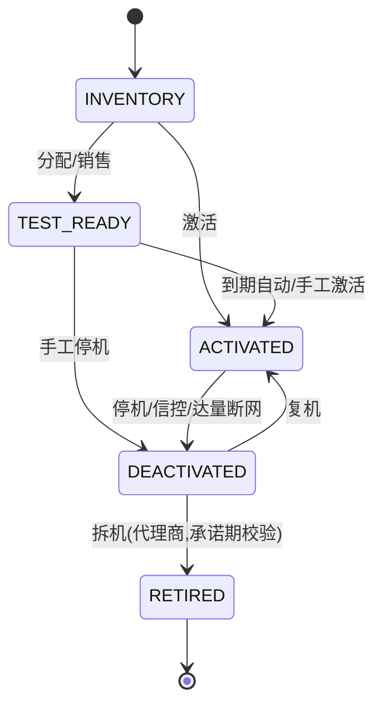

**流程图**

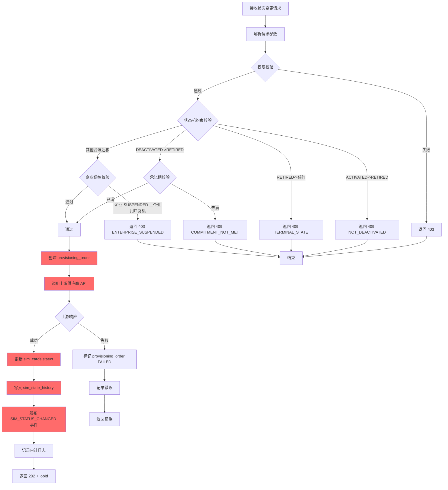

**时序图**

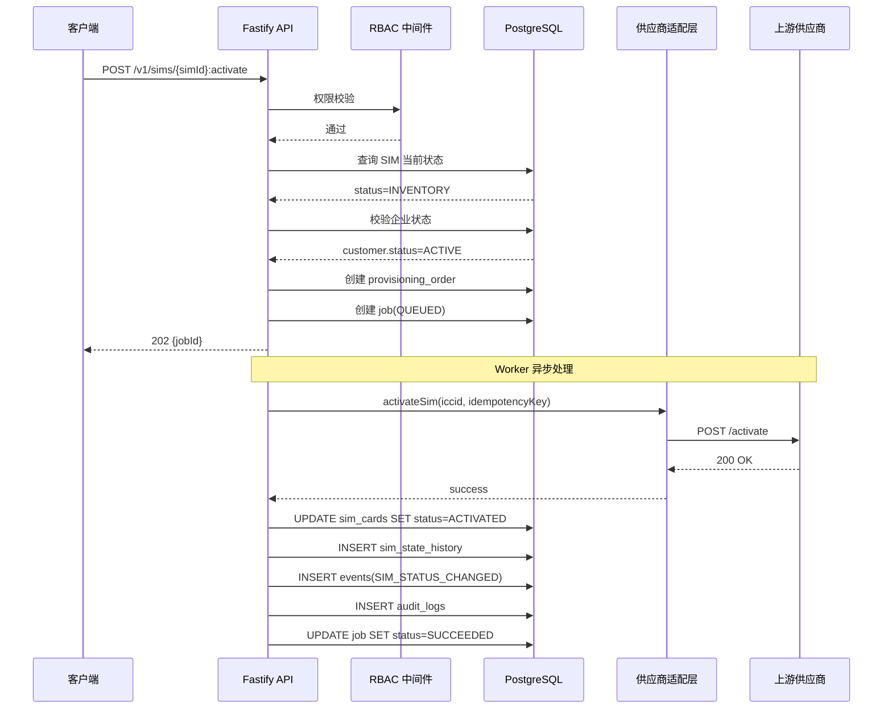

**字段变更**

| 字段 | 操作 | 逻辑 |
|:-----|:-----|:-----|
| sim_cards.status | 读/写 | 读取当前状态，校验状态机约束后更新 |
| sim_cards.upstream_status | 写 | 同步上游确认状态 |
| sim_cards.activation_date | 写 | 首次激活时写入 |
| sim_state_history.* | 写 | 插入 Type 2 SCD 记录 |
| provisioning_orders.* | 写 | 创建开通同步订单 |
| events.* | 写 | 发布 SIM_STATUS_CHANGED 事件 |
| audit_logs.* | 写 | 记录操作审计 |

### 4.2 计费引擎 — 高水位月租费

**流程图**

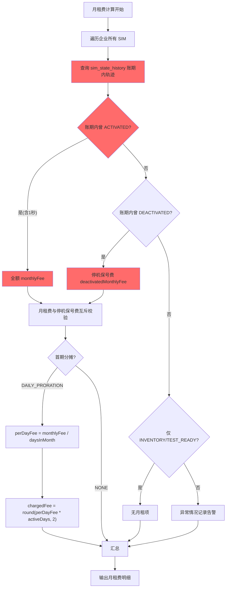

**字段变更**

| 字段 | 操作 | 逻辑 |
|:-----|:-----|:-----|
| sim_state_history.after_status | 读 | 判定账期内最高状态（高水位） |
| sim_state_history.start_time/end_time | 读 | 确定状态持续时段 |
| price_plan_versions.monthly_fee | 读 | 全额月租费 |
| price_plan_versions.deactivated_monthly_fee | 读 | 停机保号费 |
| price_plan_versions.first_cycle_proration | 读 | 分摊策略 |
| rating_results.* | 写 | 输出计费明细 |

### 4.3 计费引擎 — Waterfall 用量匹配

**流程图**

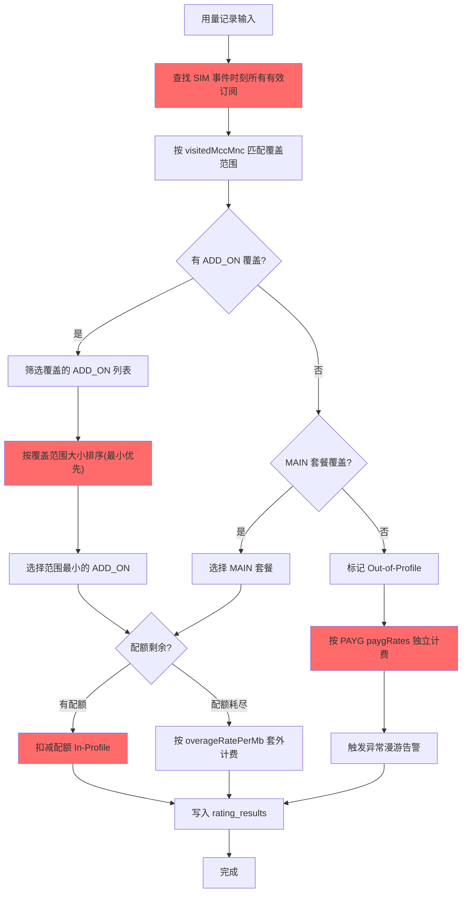

**时序图**

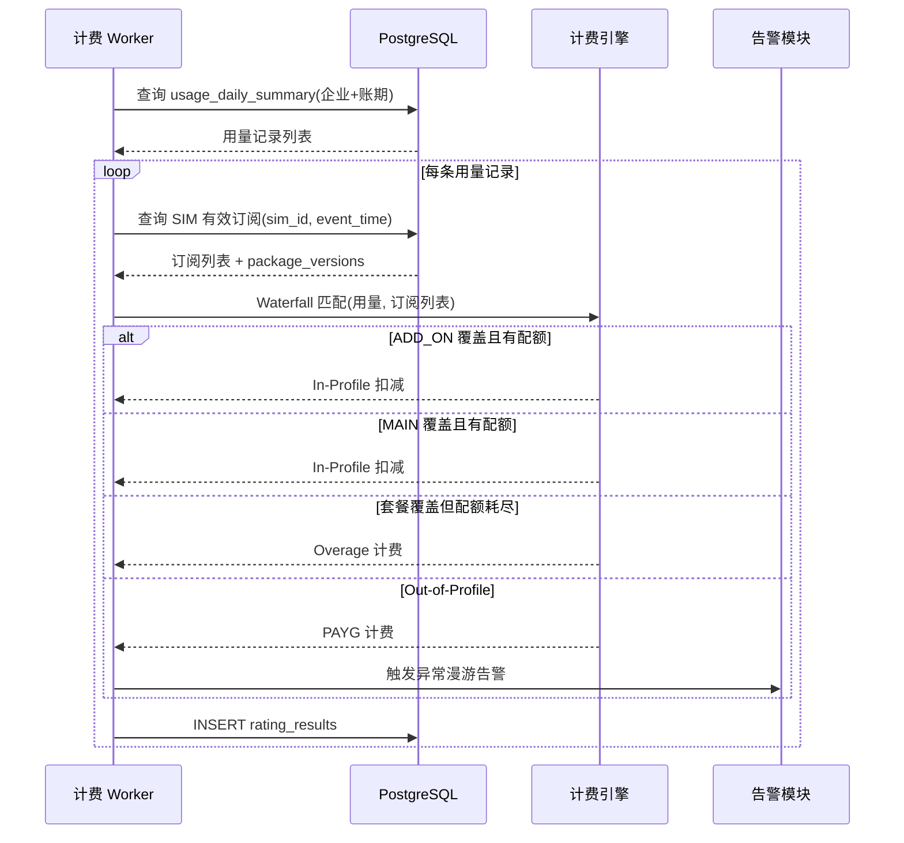

**字段变更**

| 字段 | 操作 | 逻辑 |
|:-----|:-----|:-----|
| usage_daily_summary.* | 读 | 输入用量数据 |
| subscriptions.effective_at/expires_at | 读 | 时间窗匹配 |
| subscriptions.subscription_kind | 读 | 区分 MAIN/ADD_ON |
| package_versions.roaming_profile | 读 | 区域覆盖匹配 |
| price_plan_versions.payg_rates | 读 | PAYG 费率查询 |
| price_plan_versions.overage_rate_per_mb | 读 | 套外单价 |
| rating_results.classification | 写 | IN_PROFILE/OVERAGE/OUT_OF_PROFILE |
| alerts.* | 写 | Out-of-Profile 时触发告警 |

### 4.4 Dunning 信控催收流程

**流程图**

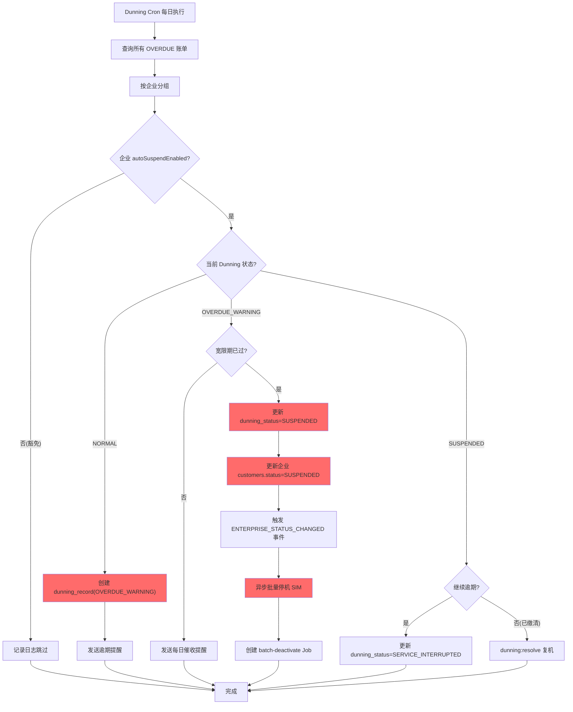

**时序图**

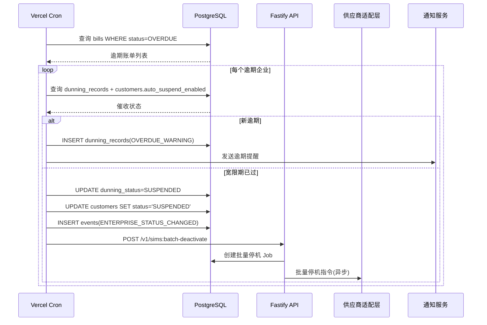

**字段变更**

| 字段 | 操作 | 逻辑 |
|:-----|:-----|:-----|
| bills.status/due_date | 读 | 判定是否逾期 |
| dunning_records.* | 读/写 | 创建/更新催收状态 |
| dunning_actions.* | 写 | 记录催收动作 |
| customers.status | 写 | 更新为 SUSPENDED |
| customers.auto_suspend_enabled | 读 | 判定是否豁免 |
| sim_cards.status | 写 | 批量停机 |
| events.* | 写 | ENTERPRISE_STATUS_CHANGED 事件 |

### 4.5 订阅管理 — 创建与切换

**流程图**

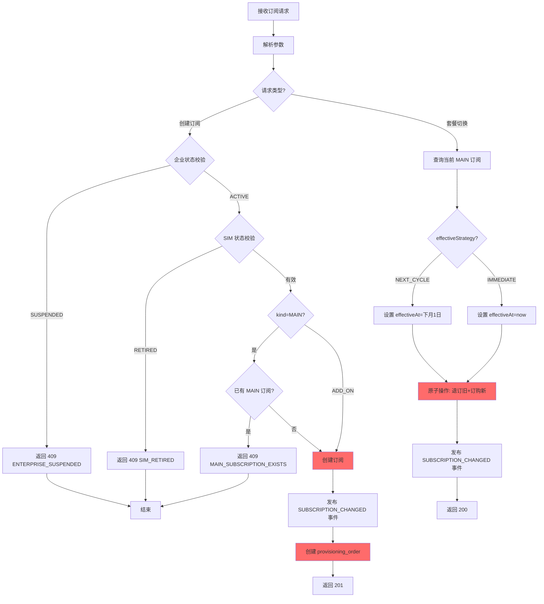

**字段变更**

| 字段 | 操作 | 逻辑 |
|:-----|:-----|:-----|
| subscriptions.* | 读/写 | 校验现有订阅，创建新订阅 |
| subscriptions.state | 写 | 退订时更新为 CANCELLED/EXPIRED |
| subscriptions.cancelled_at | 写 | 退订时间 |
| sim_cards.status | 读 | SIM 状态校验 |
| customers.status | 读 | 企业状态校验 |
| provisioning_orders.* | 写 | 创建开通同步订单 |
| events.* | 写 | SUBSCRIPTION_CHANGED 事件 |

### 4.6 账单生成与出账

**流程图**

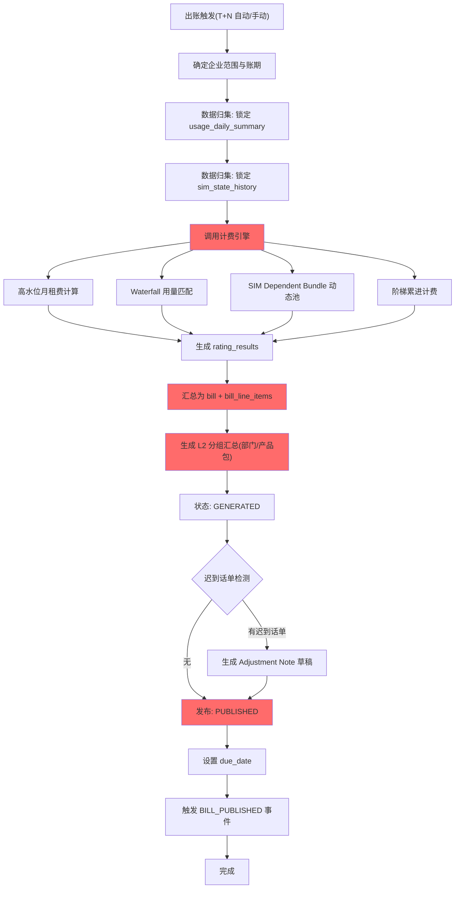

**字段变更**

| 字段 | 操作 | 逻辑 |
|:-----|:-----|:-----|
| usage_daily_summary.* | 读 | 归集用量数据 |
| sim_state_history.* | 读 | 高水位月租判定 |
| rating_results.* | 写 | 批价计费结果 |
| bills.* | 写 | 创建账单（GENERATED→PUBLISHED） |
| bill_line_items.* | 写 | L3 SIM 级明细 |
| bill_line_items.group_key/group_type | 写 | L2 分组标记 |
| adjustment_notes.* | 写 | 迟到话单调账草稿 |
| events.* | 写 | BILL_PUBLISHED 事件 |

### 4.7 Webhook 投递

**流程图**

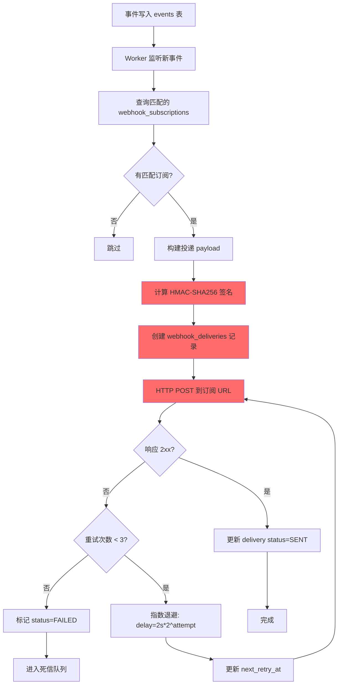

**字段变更**

| 字段 | 操作 | 逻辑 |
|:-----|:-----|:-----|
| events.* | 读 | 事件数据源 |
| webhook_subscriptions.url/secret/event_types | 读 | 订阅配置 |
| webhook_deliveries.* | 写 | 投递记录追踪 |
| webhook_deliveries.attempt/next_retry_at | 写 | 重试管理 |

### 4.8 上游对账（Reconciliation）

**流程图**

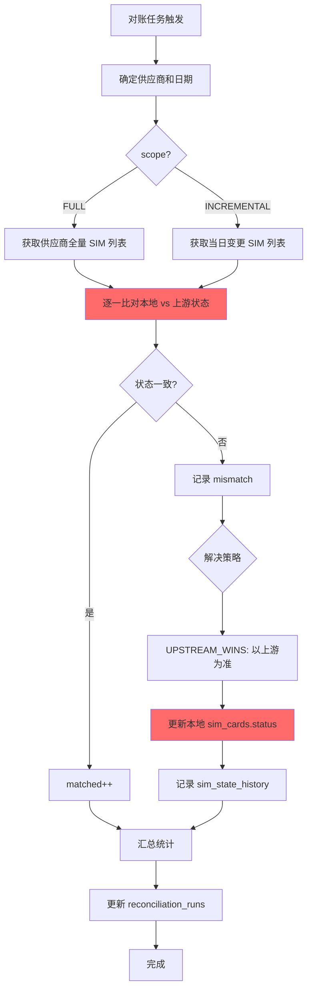

**字段变更**

| 字段 | 操作 | 逻辑 |
|:-----|:-----|:-----|
| reconciliation_runs.* | 写 | 对账任务记录 |
| sim_cards.status/upstream_status | 读/写 | 状态比对与同步 |
| sim_state_history.* | 写 | 状态变更记录 |

### 4.9 接口定义

> 采用 RESTful API 定义（本项目不使用 Thrift）

#### POST /v1/sims/{simId}:activate

**Request**:
```json
{
  "reason": "string (optional)",
  "idempotencyKey": "string (optional)"
}
```

**Response 202**:
```json
{
  "jobId": "uuid",
  "simId": "uuid",
  "requestedStatus": "ACTIVATED",
  "currentStatus": "INVENTORY",
  "message": "Activation request submitted"
}
```

---

#### POST /v1/subscriptions

**Request**:
```json
{
  "iccid": "string (required, 18-20 digits)",
  "packageVersionId": "uuid (required)",
  "kind": "MAIN | ADD_ON (default MAIN)",
  "effectiveAt": "datetime (optional, default now)",
  "enterpriseId": "uuid (required)"
}
```

**Response 201**:
```json
{
  "subscriptionId": "uuid",
  "iccid": "string",
  "packageVersionId": "uuid",
  "kind": "MAIN",
  "state": "ACTIVE",
  "effectiveAt": "2026-02-08T10:00:00Z"
}
```

---

#### POST /v1/subscriptions:switch

**Request**:
```json
{
  "iccid": "string (required)",
  "newPackageVersionId": "uuid (required)",
  "effectiveStrategy": "NEXT_CYCLE | IMMEDIATE (default NEXT_CYCLE)"
}
```

**Response 200**:
```json
{
  "cancelledSubscriptionId": "uuid",
  "newSubscriptionId": "uuid",
  "effectiveAt": "2026-03-01T00:00:00Z"
}
```

---

#### POST /v1/billing:generate

**Request**:
```json
{
  "enterpriseId": "uuid (optional)",
  "period": "string (required, e.g. '2026-02')"
}
```

**Response 202**:
```json
{
  "jobId": "uuid",
  "period": "2026-02",
  "status": "QUEUED"
}
```

---

#### POST /v1/bills/{billId}:mark-paid

**Request**:
```json
{
  "paidAmount": "number (required)",
  "paymentRef": "string (required)",
  "paidAt": "datetime (optional, default now)"
}
```

**Response 200**:
```json
{
  "billId": "uuid",
  "status": "PAID",
  "paidAmount": 15480.50,
  "paymentRef": "PAY-2026030801"
}
```

---

#### POST /v1/enterprises/{enterpriseId}/dunning:resolve

**Request**:
```json
{
  "reason": "string (optional)"
}
```

**Response 200**:
```json
{
  "enterpriseId": "uuid",
  "dunningStatus": "NORMAL",
  "enterpriseStatus": "ACTIVE",
  "resolvedAt": "2026-03-08T10:00:00Z"
}
```

---

#### POST /v1/reconciliation:run

**Request**:
```json
{
  "supplierId": "uuid (required)",
  "date": "string (required, e.g. '2026-02-08')",
  "scope": "FULL | INCREMENTAL (default INCREMENTAL)"
}
```

**Response 202**:
```json
{
  "runId": "uuid",
  "supplierId": "uuid",
  "status": "RUNNING",
  "date": "2026-02-08"
}
```

---

#### POST /v1/webhook-subscriptions

**Request**:
```json
{
  "url": "string (required, HTTPS)",
  "events": ["SIM_STATUS_CHANGED", "BILL_PUBLISHED", "ALERT_TRIGGERED"],
  "secret": "string (required)",
  "enabled": true,
  "description": "string (optional)"
}
```

**Response 201**:
```json
{
  "subscriptionId": "uuid",
  "url": "https://example.com/webhooks",
  "events": ["SIM_STATUS_CHANGED", "BILL_PUBLISHED", "ALERT_TRIGGERED"],
  "enabled": true
}
```

---

## 5. 检查清单

> DDL 变更与资源任务

- [ ] DDL: 0019 — 创建 reseller_branding 表
- [ ] DDL: 0020 — 创建 dunning_status ENUM + dunning_records 表 + dunning_actions 表
- [ ] DDL: 0021 — 创建 alert_type ENUM + alerts 表 + 索引
- [ ] DDL: 0022 — 创建 webhook_subscriptions 表 + webhook_deliveries 表 + 索引
- [ ] DDL: 0023 — 创建 vendor_product_mappings 表
- [ ] DDL: 0024 — 创建 provisioning_status ENUM + provisioning_orders 表 + 索引
- [ ] DDL: 0025 — 创建 reconciliation_runs 表
- [ ] DDL: 0026 — 创建 sim_form_factor ENUM + ALTER sim_cards 新增 secondary IMSI/形态/IMEI Lock/激活码字段
- [ ] DDL: 0027 — ALTER bills 新增 reseller_id/payment_ref/overdue_at + ALTER bill_line_items 新增 group_key/group_type/group_subtotal
- [ ] DDL: 0028 — ALTER jobs 新增 reseller_id/customer_id/idempotency_key/file_hash
- [ ] DDL: 0029 — 新增索引（bills, subscriptions, usage_daily_summary, audit_logs, events 等 8 个索引）
- [ ] DDL: 0030 — 新增 9 个新表的 RLS 行级安全策略
